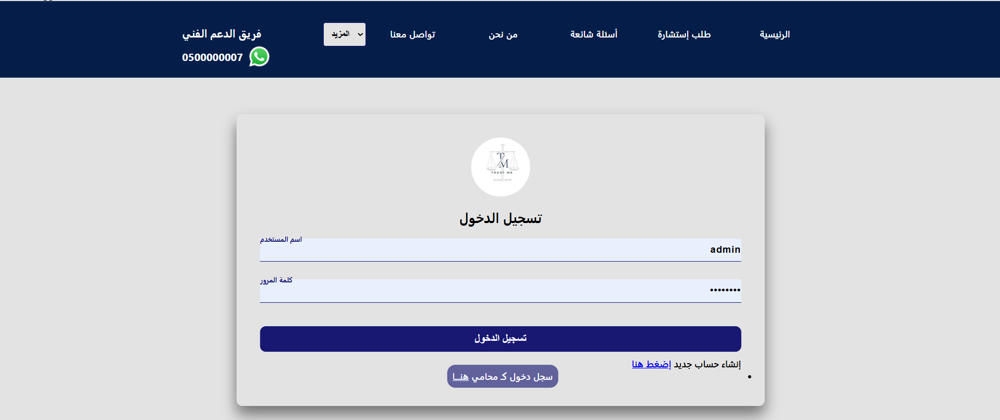
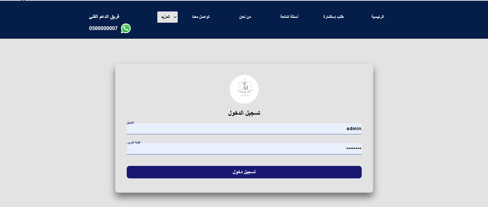
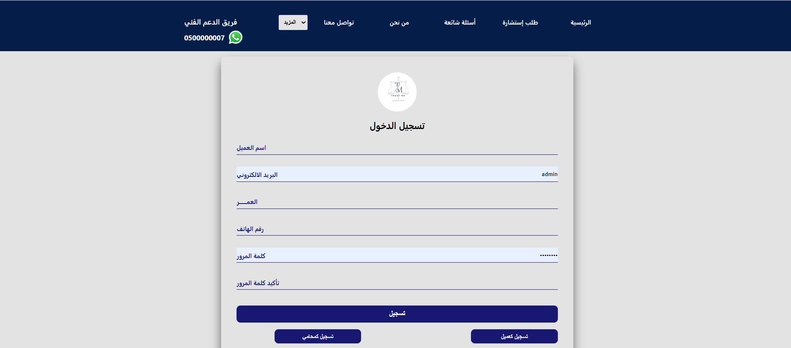
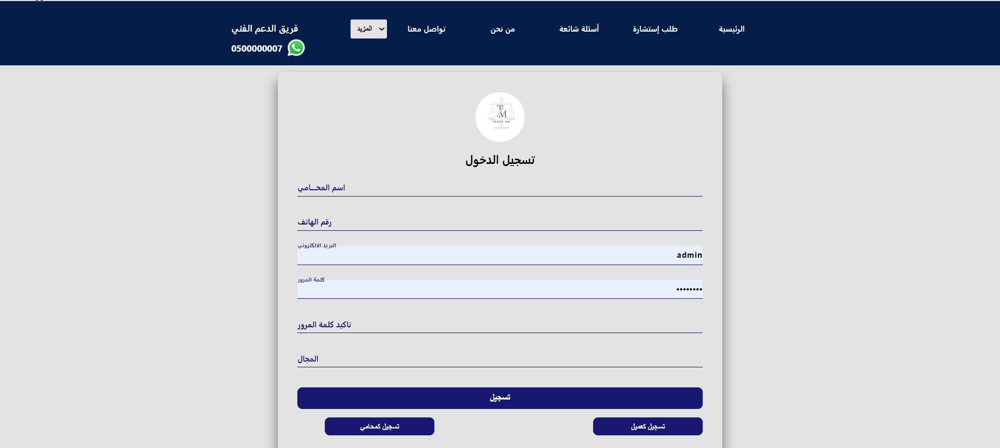
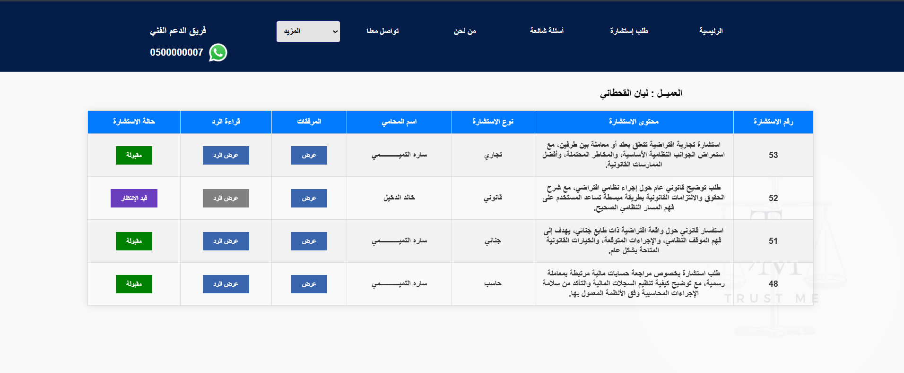
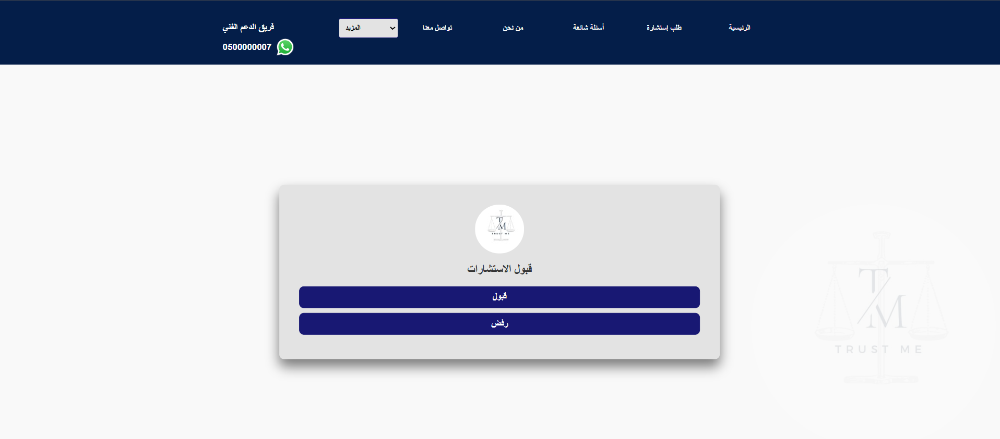
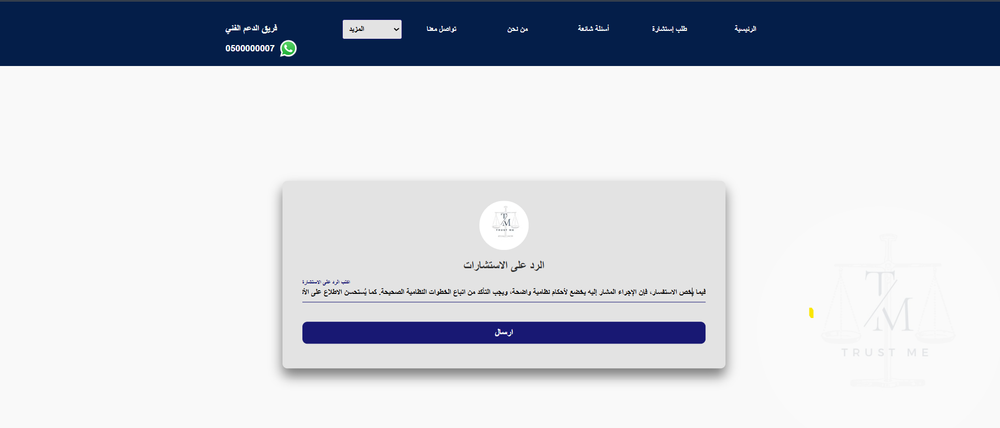
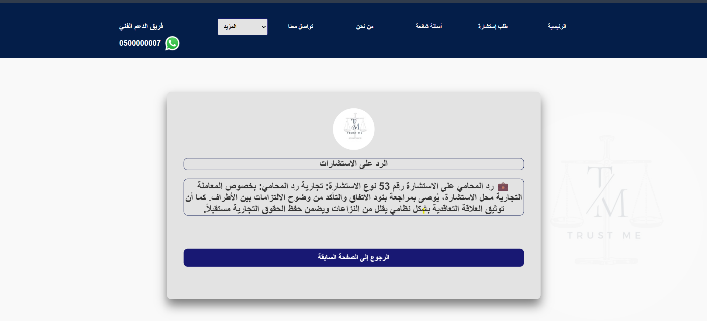
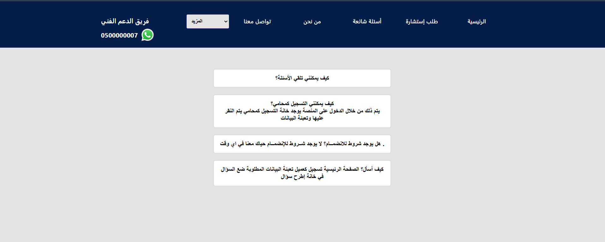

 # Trust_Me

**Trust_Me** is a simple Arabic (RTL) legal consultation platform where **clients** and **lawyers** can register, exchange consultations and replies, upload files, and submit evaluations.

> Portfolio note: Screenshots and sample data are for demo purposes.

---

## ✨ Features

### 👥 Accounts & Roles
- Client registration/login
- Lawyer registration/login
- Role-based access (client vs lawyer dashboards)

### 📩 Consultations Workflow
- Clients submit legal consultations (with optional file attachments)
- Lawyers review consultations and **Accept / Reject**
- Lawyers reply to accepted consultations
- Clients can view lawyer replies and track consultation status

### 📎 File Uploads
- Client uploads for consultation attachments
- Lawyer CV upload (profile update)

### ⭐ Evaluation
- Clients can submit evaluation/feedback after receiving a reply

### ❓ FAQ
- A dedicated FAQ page to guide users

---

## 📸 Screenshots

### 🔐 Login
**Client Login**  


**Lawyer Login**  


---

### 📝 Signup
**Client Signup**  


**Lawyer Signup**  


---

### 📋 Dashboards
**Client Consultations**  


**Lawyer Consultations**  


---

### ✅ Consultation Management
**Accept / Reject Consultation**  


**Reply to Consultation (Lawyer)**  


**View Reply (Client)**  


---

### 👤 Profile Management
**Update Lawyer Info + CV Upload**  


---

### ❓ FAQ


---

### 🏠 Home


---

## 🧰 Tech Stack
- **Backend:** PHP
- **Database:** MySQL
- **UI:** PHP + CSS (RTL-friendly)
- **Uploads:** `uploads/`, `uploads_files_con/`
- **Schema:** `Sql/New_database/website_db.sql`
- **Root folder in archive:** `Turst_Me` (note the spelling)

---

## ✅ Requirements
- PHP 8.x with extensions: `mysqli`, `mbstring`, `json`, `fileinfo`, `openssl`, `curl`
- MySQL 8.x or MariaDB 10.x
- Apache or Nginx + PHP-FPM
- UTF-8 database (`utf8mb4`)

---

## 🚀 Quick Start

### 1) Create database and import schema
```sql
CREATE DATABASE trust_me DEFAULT CHARACTER SET utf8mb4 COLLATE utf8mb4_unicode_ci;
USE trust_me;
SOURCE Sql/New_database/website_db.sql;
2) Configure DB connection in connection.php
php
Copy code
$host = '127.0.0.1';
$user = 'trust_user';
$pass = 'strong_password';
$db   = 'trust_me';
3) S
bash
Copy code
chmod -R 755 uploads uploads_files_con
# if the web server needs write access:
chmod -R 775 uploads uploads_files_con
4) Run locally (option
bash
Copy code
php -S 0.0.0.0:8080 -t .
Visit:

text
Copy code
http://localhost:8080/Turst_Me/index.php
📁 Project Structure
text
Copy code
Turst_Me/
├─ index.php
├─ Home.php
├─ about_us.php
├─ contact_us.php
├─ Qustions.php
├─ send_qustion.php
├─ consultations.php
├─ consultations_client.php
├─ replay.php
├─ View_replay.php
├─ evaluation.php
├─ login_clients.php
├─ login_lawyer.php
├─ signup_Clients.php
├─ signup_laywer.php
├─ laywer.php
├─ accept.php
├─ logout.php
├─ connection.php
├─ inc/
│  ├─ header.php
│  └─ Session.php
├─ css/
│  ├─ style.css
│  ├─ laywer_style.css
│  ├─ Styles_Qustions.css
│  ├─ Style_conslation.css
│  ├─ style_evaluation.css
│  ├─ style_update_info_lawyer.css
│  └─ about_us_styles.css
├─ image/
├─ uploads/
├─ uploads_files_con/
├─ Screenshot/
└─ Sql/New_database/website_db.sql
🧩 Core Pages & Functions
Auth (Clients): login_clients.php, signup_Clients.php, logout.php

Auth (Lawyers): login_lawyer.php, signup_laywer.php, laywer.php

Questions: Qustions.php, send_qustion.php

Consultations: consultations.php, consultations_client.php

Replies: replay.php, View_replay.php, accept.php

Evaluation: evaluation.php

Public: index.php, Home.php, about_us.php, contact_us.php

Shared: inc/header.php, inc/Session.php, connection.php

🔒 Security Notes (Recommended)
Use prepared statements for all SQL queries

Validate and sanitize inputs (server-side)

Restrict upload MIME types and file size

Regenerate session IDs on login

Enable httponly and secure cookies (HTTPS)

Disable error display in production

🌐 Deployment
Apache or Nginx + PHP-FPM

Consider blocking direct access to private upload paths if needed

DB backups and log rotation

🗺️ Roadmap
Move to a simple MVC structure / routing

Centralize validation + CSRF tokens

Improve responsive UI and unify CSS

Add audit logging for sensitive actions

 ## 👤 Developer

- **Saleh Al-Shaebi**  
  *Information Technology Graduate | Freelance Developer*  

🔗 **LinkedIn:**  
[Saleh Al-Shaebi](https://www.linkedin.com/in/saleh-al-shaebi-1903263aa)
